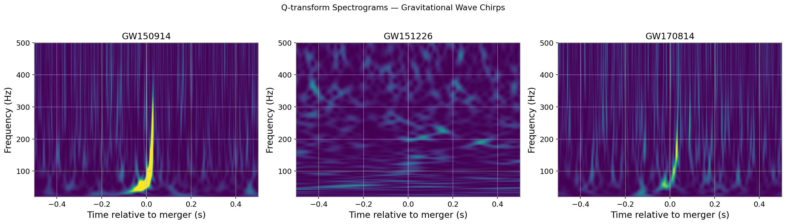

# Gravitational Wave Denoising Autoencoder

I built this 1D convolutional autoencoder to clean up LIGO strain data. The goal is to suppress typical detector noise and boost the signal-to-noise ratio (SNR) on real gravitational wave events. 

### How it Works
The basic idea is self-supervised learning: if you train an autoencoder *purely* on quiet detector noise, it learns to reconstruct only that noise. When you feed it a segment containing a real gravitational wave, it will struggle to reconstruct the wave anomaly. By taking the residual (Input − Reconstruction), you effectively isolate the gravitational wave signal.

Before feeding anything into the model, the data pipeline does some heavy lifting:
1. Fetches strain data directly from GWOSC.
2. Whitens the signal to flatten the power spectral density (so all frequencies contribute equally).
3. Applies a 35–350 Hz bandpass filter to kill off the low-frequency seismic noise and high-frequency shot noise.
4. Chunks the data into 1-second Tukey-windowed segments (4096 samples) with a 50% overlap.

I went with 1D convolutions because they naturally preserve the temporal structure of the time series. 

### Architecture
The model is pretty lightweight, sitting at just 25,569 parameters. 
* **Training Data:** ~3,000 quiet noise segments from GWOSC.
* **Encoder:** 3 Conv1d layers (using BatchNorm and stride=2), which steps the 4096 samples down to a 512-dimensional bottleneck.
* **Decoder:** 3 ConvTranspose1d layers mirroring the encoder to rebuild the signal.

### Results
Does it actually help? Yes. It performs best on weaker signals where the noise floor is the dominant issue. Here are the SNR bumps on a few classic events:

| Event | Orig. SNR | New SNR | Improvement |
| :--- | :--- | :--- | :--- |
| **GW150914** | 7.404 | 8.017 | +0.69 dB |
| **GW151226** | 3.128 | 3.569 | +1.15 dB |
| **GW170814** | 4.016 | 4.049 | +0.07 dB |

*(Notice that GW151226 got the biggest boost—the autoencoder shines when the signal is struggling to poke through the noise.)*

Here's what the cleaned-up chirp signals look like after passing through the filter:



### Running it locally

You'll need PyTorch plus a few physics/audio-specific libraries to handle the LIGO data.

```bash
pip install gwpy gwosc pycbc torch numpy scipy matplotlib
```
